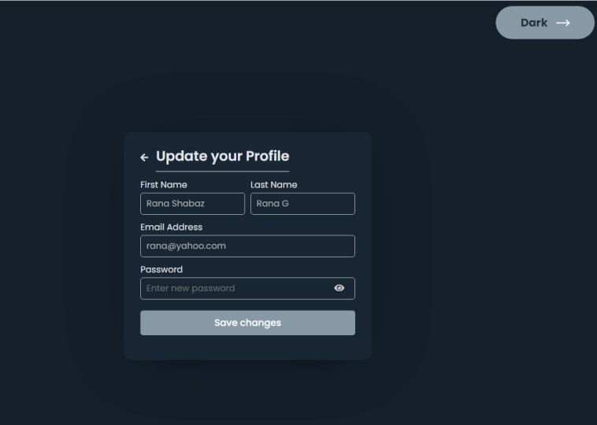

# Chatter
## This is realtime application

Chatter is a Web, mobile-ready compatible.
HTML5, Vanilla JavaScript, XHR base.

## Features

- Real time massaging.
- Light and Dark theme mode.
- Media Message e.g texting, photographs, songs, and movies
- Notification e.g Typing, Last Seen, Last Message and Count.
- Message Details, Delete and Copy as clipboard
- Update you E-mail, Profile Photo, etc.
- Manage you Password.
- Search Peoples by name.

> Chatter application is lightweight
> web base on group public chat in private.

## Installation

Chatter requires [Javascript](https://www.javascript.com/) ES6 to run smooth.

Install the dependencies and devDependencies and start the server.

```php
cd chatter/
```
**Open :**  `storage/Database.php`
```
    const HOST = '';
    const DB_NAME = '';
    const USERNAME = '';
    const PASSWORD = '';
```
**Inport to sql:**  `storage/chatter.sql`
### Storage: MySQL
```sql
-- PHP Version: 7.2.22

CREATE TABLE `messages` (
  `id` INT AUTO_INCREMENT primary key NOT NULL,
  `sender` int(11) NOT NULL,
  `receiver` int(11) NOT NULL,
  `message` text NOT NULL,
  `readed` tinyint(1) NOT NULL,
  `date_time` datetime DEFAULT CURRENT_TIMESTAMP ON UPDATE CURRENT_TIMESTAMP
) ENGINE=MyISAM DEFAULT CHARSET=utf8mb4;

CREATE TABLE `notifications` (
  `typer_id` int(11) NOT NULL,
  `is_typed` tinyint(1) NOT NULL,
  `date_time` timestamp NULL DEFAULT NULL
) ENGINE=MyISAM DEFAULT CHARSET=utf8mb4;

CREATE TABLE `message_media` (
  `msg_id` int(11) NOT NULL,
  `media` mediumblob NOT NULL,
  `which_media` enum('video','image') NOT NULL
) ENGINE=MyISAM DEFAULT CHARSET=utf8mb4;

CREATE TABLE `users` (
  `id` INT AUTO_INCREMENT primary key NOT NULL,
  `first_name` varchar(255) NOT NULL,
  `last_name` varchar(255) NOT NULL,
  `email` varchar(255) NOT NULL,
  `password` varchar(255) NOT NULL,
  `image` mediumblob,
  `status` datetime DEFAULT NULL
) ENGINE=MyISAM DEFAULT CHARSET=utf8mb4;

CREATE TABLE `visitor` (
  `id`  INT AUTO_INCREMENT primary key NOT NULL,
  `ip` varchar(20) NOT NULL,
  `agent` varchar(255) NOT NULL,
  `server_ip` varchar(20) NOT NULL,
  `date_time` timestamp NOT NULL DEFAULT CURRENT_TIMESTAMP
) ENGINE=MyISAM DEFAULT CHARSET=latin1;
```
**Visit your local URL :** http://localhost/chatter/ui/index.html
# Presentation
- [Live Demo](http://chatter.lovestoblog.com)
## ScreenShoot

<div>
  
  
  
  
  
  
  
  
</div>

## License
MIT

**Free Software, Hell Yeah!**
